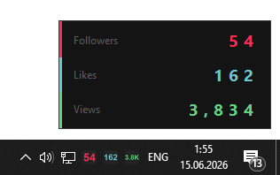

# TikTok Tray Widget

A lightweight Windows system-tray widget that shows your TikTok **followers**, **likes**, and **total video views** in real time — right on the taskbar.



---

## Features

- Three tray icons: followers · likes · views
- Click any icon to open an animated detail popup
- Sound notifications on new followers / new likes (configurable WAV files)
- Per-type mute: mute all sounds or just likes sounds from the tray menu
- Volume control (0.0 – 1.0) in `settings.json`
- Flip-digit animation in the popup (Solari board style)
- OAuth 2.0 PKCE login — no password stored, token auto-refreshes

---

## Requirements

- Windows 10/11
- Python 3.10+
- A [TikTok Developer App](https://developers.tiktok.com/) with the scopes:
  `user.info.basic`, `user.info.profile`, `user.info.stats`, `video.list`

Install dependencies:

```
pip install -r requirements.txt
```

---

## Setup

**1. Create a TikTok Developer App**

Go to [developers.tiktok.com](https://developers.tiktok.com/), create an app, and add a redirect URI:

```
http://localhost:8080/callback
```

Copy your **Client Key** and **Client Secret**.

**2. Create `settings.json`**

Copy the example below and fill in your credentials:

```json
{
  "client_key":      "YOUR_CLIENT_KEY",
  "client_secret":   "YOUR_CLIENT_SECRET",
  "redirect_uri":    "http://localhost:8080/callback",
  "scopes":          "user.info.basic,user.info.profile,user.info.stats,video.list",
  "poll_interval":   60,
  "color_followers": [254, 44,  85],
  "color_likes":     [105, 201, 208],
  "color_views":     [100, 210, 130],
  "views_enabled":   false,
  "sound_likes":     "snd/1.wav",
  "sound_followers": "snd/2.wav",
  "sound_volume":    1.0
}
```

> `settings.json` and `token.json` are in `.gitignore` — your credentials will never be committed.

**3. Run**

Double-click `start.bat`, or:

```
python tiktok_widget.py
```

The browser will open for TikTok login on the first run. After that the token refreshes automatically.

---

## Settings reference

| Key | Default | Description |
|-----|---------|-------------|
| `client_key` | — | TikTok app Client Key |
| `client_secret` | — | TikTok app Client Secret |
| `redirect_uri` | `http://localhost:8080/callback` | Must match your TikTok app settings |
| `poll_interval` | `60` | Seconds between API requests |
| `color_followers` | `[254,44,85]` | RGB color of the followers icon |
| `color_likes` | `[105,201,208]` | RGB color of the likes icon |
| `color_views` | `[100,210,130]` | RGB color of the views icon |
| `views_enabled` | `false` | Enable/disable views counter |
| `sound_likes` | `snd/1.wav` | WAV file played when likes increase |
| `sound_followers` | `snd/2.wav` | WAV file played when followers increase |
| `sound_volume` | `1.0` | Playback volume (0.0 – 1.0) |

---

## Tray menu

Right-click any tray icon to access:

- **Sound: ON/OFF** — mute all notification sounds
- **Likes sound: ON/OFF** — mute likes sounds only
- **Views: ON/OFF** — toggle views counter
- **Refresh now** — fetch stats immediately
- **Exit**

---
---

# TikTok Tray Widget (на русском)

Лёгкий виджет для системного трея Windows, который показывает ваши TikTok **подписчики**, **лайки** и **просмотры** в реальном времени прямо на панели задач.


---

## Возможности

- Три иконки в трее: подписчики · лайки · просмотры
- Клик по любой иконке открывает попап с анимированными цифрами
- Звуковые уведомления при новых подписчиках / лайках (настраиваемые WAV-файлы)
- Раздельный мьют: отключить все звуки или только звук лайков
- Управление громкостью (0.0 – 1.0) в `settings.json`
- Анимация цифр в попапе в стиле табло Solari
- Авторизация по OAuth 2.0 PKCE — пароль нигде не хранится, токен обновляется автоматически

---

## Требования

- Windows 10/11
- Python 3.10+
- Приложение в [TikTok Developer Portal](https://developers.tiktok.com/) со скоупами:
  `user.info.basic`, `user.info.profile`, `user.info.stats`, `video.list`

Установка зависимостей:

```
pip install -r requirements.txt
```

---

## Настройка

**1. Создайте приложение в TikTok Developer Portal**

Зайдите на [developers.tiktok.com](https://developers.tiktok.com/), создайте приложение и добавьте redirect URI:

```
http://localhost:8080/callback
```

Скопируйте **Client Key** и **Client Secret**.

**2. Создайте файл `settings.json`**

Скопируйте пример ниже и вставьте свои данные:

```json
{
  "client_key":      "ВАШ_CLIENT_KEY",
  "client_secret":   "ВАШ_CLIENT_SECRET",
  "redirect_uri":    "http://localhost:8080/callback",
  "scopes":          "user.info.basic,user.info.profile,user.info.stats,video.list",
  "poll_interval":   60,
  "color_followers": [254, 44,  85],
  "color_likes":     [105, 201, 208],
  "color_views":     [100, 210, 130],
  "views_enabled":   false,
  "sound_likes":     "snd/1.wav",
  "sound_followers": "snd/2.wav",
  "sound_volume":    1.0
}
```

> `settings.json` и `token.json` прописаны в `.gitignore` — ключи никогда не попадут в репозиторий.

**3. Запуск**

Дважды кликните `start.bat`, или запустите вручную:

```
python tiktok_widget.py
```

При первом запуске откроется браузер для авторизации в TikTok. Далее токен обновляется сам.

---

## Описание настроек

| Ключ | По умолчанию | Описание |
|------|-------------|----------|
| `client_key` | — | Client Key вашего TikTok-приложения |
| `client_secret` | — | Client Secret вашего TikTok-приложения |
| `redirect_uri` | `http://localhost:8080/callback` | Должен совпадать с настройками приложения |
| `poll_interval` | `60` | Интервал опроса API в секундах |
| `color_followers` | `[254,44,85]` | RGB-цвет иконки подписчиков |
| `color_likes` | `[105,201,208]` | RGB-цвет иконки лайков |
| `color_views` | `[100,210,130]` | RGB-цвет иконки просмотров |
| `views_enabled` | `false` | Включить/выключить счётчик просмотров |
| `sound_likes` | `snd/1.wav` | WAV-файл при новых лайках |
| `sound_followers` | `snd/2.wav` | WAV-файл при новых подписчиках |
| `sound_volume` | `1.0` | Громкость воспроизведения (0.0 – 1.0) |

---

## Меню трея

Правой кнопкой по любой иконке в трее:

- **Sound: ON/OFF** — мьют всех звуков
- **Likes sound: ON/OFF** — мьют только звука лайков
- **Views: ON/OFF** — включить/выключить просмотры
- **Refresh now** — обновить данные немедленно
- **Exit** — выход
